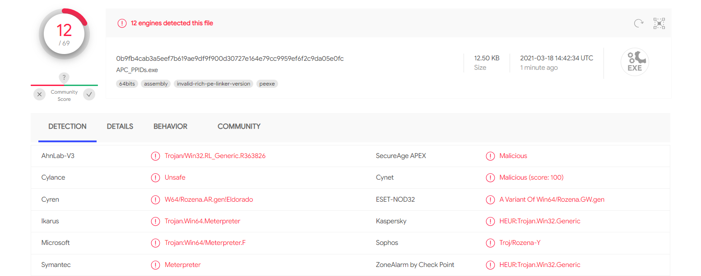
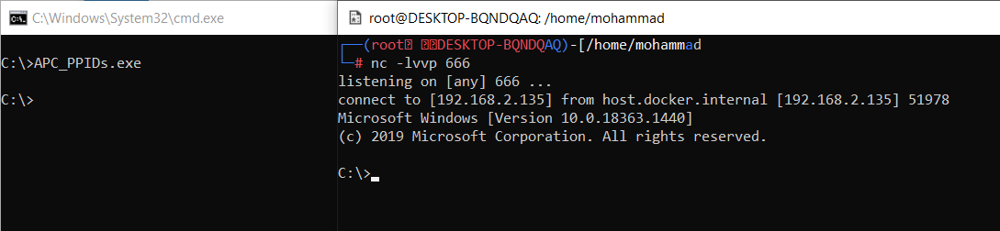

# Spoofi

  

A tool to inject Shellcode into the remote process.

Features:
- Parent Process Spoofing
- Injection through APC
- Dynamic API resolution
- Low detection rate (on VT AV engines)

How to Use:
1. Put your shellcode in the shellcode variable
2. Put your desired process full path in TargetProcess variable (Default value: iexplore.exe full path)
3. Put your desired parent process in ParentProcess variable (Default value: "explorer.exe").
4. Compile the Code
5. Execute it by CMD or PowerShell
 
 
 
